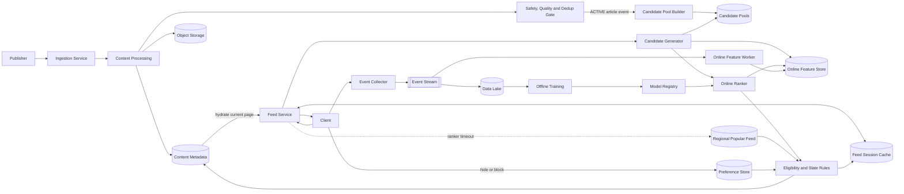

# Personalized News Feed — System Design Interview Quick Reference

This is an interview guide, not a single “correct” production architecture. The goal is to demonstrate how you resolve ambiguity, establish scope, propose a coherent design, defend tradeoffs, investigate one risky area deeply, and close the interview clearly.

The running problem is:

> Design a backend that produces a personalized news feed for millions of readers. It should incorporate machine-learning ranking, react to user feedback, admit fresh articles quickly, and remain available at low latency when personalization components fail.

## The four-step interview framework

| Step | Typical 45-minute budget | Main outcome |
|---|---:|---|
| 1. Understand the problem and establish scope | 5–8 minutes | Agreed requirements, scale, assumptions, exclusions, and success criteria |
| 2. Propose a high-level design and get buy-in | 10–12 minutes | Main components and end-to-end flows accepted by the interviewer |
| 3. Design deep dive | 18–20 minutes | One critical path examined through normal operation, scale, correctness, failure, mitigation, and tradeoffs |
| 4. Wrap up | 3–5 minutes | Recap, primary tradeoff, weaknesses, operations, and next-scale improvements |

For a 60-minute interview, expand Step 2 and Step 3 rather than spending 20–30 minutes clarifying requirements. Treat the budgets as pacing guides, not rigid countdowns.

---

## Step 1 — Understand the problem and establish scope

Do not begin by drawing databases and queues. First ask questions whose answers could change the architecture.

### Functional scope

- What content appears in the feed: publisher articles, user-generated posts, video, or a mixture?
- Is article ingestion in scope, or is an existing ingestion system an upstream dependency?
- Do readers only open articles, or can they hide, save, like, follow, and block?
- Is the feed infinite-scroll with cursor pagination?
- Must an active pagination session remain stable while new content arrives?
- How much of the ML lifecycle is in scope: candidate generation, online inference, feature processing, training, and deployment?
- Are advertising, publisher crawling, media delivery, and editorial tools in or out of scope?

### Scale and workload

Ask for values that influence design decisions:

- Daily active users and geographic distribution.
- Sessions per user per day.
- Pages per session and stories per page.
- Peak-to-average traffic multiplier.
- New articles per day.
- Impression, click, and explicit-feedback volume.

Example interview assumptions:

```text
10 million daily active users
5 feed sessions per user per day
4 page requests per session
20 stories per page
10× peak-to-average traffic
500,000 new articles per day
```

Useful estimates:

```text
Feed requests/day
= 10M × 5 × 4
= 200M requests/day

Average feed QPS
= 200M / 86,400
≈ 2,300 QPS

Peak feed QPS
≈ 23,000 QPS

Logical impressions/day
= 200M pages × 20 stories
= 4B impressions/day
```

The 20 stories multiply impression volume, not feed-request QPS. Batch page impressions into one transport message when possible.

### Quality requirements

Clarify measurable targets rather than saying “fast” or “highly available.” For example:

- Feed API: p95 below 300 ms.
- Feed serving: 99.99% availability.
- Newly approved content: eligible within two minutes.
- Explicit hide/block feedback: effective within 30 seconds.
- Passive behavior: reflected in online features within several minutes.
- ML failure: degrade recommendation quality rather than return an error or empty feed.

### Important invariants

- Unsafe, removed, expired, or blocked content must not be returned.
- One pagination session has a stable order and does not return duplicates.
- A ranker failure must not make the feed unavailable.
- Explicit negative feedback must override cached recommendation quality.

### End Step 1 with an agreed requirements summary

Summarize aloud and keep a compact memo visible. Organize it so the functional requirements map directly to the high-level workflows in Step 2.

#### Functional requirements

- **Workflow A — Article publishing and ingestion:** Publishers or editors can publish articles; only active, safe, policy-compliant content becomes eligible for distribution.
- **Workflow B — Online feed serving:** Readers receive a personalized, cursor-paginated feed and can open the returned articles.
- **Workflow C — Feedback and learning:** Readers can click, read, save, like, hide, or block; these signals improve future recommendations.
- **Cross-flow correctness:** Removed, expired, unsafe, blocked, or duplicate content must not appear in the returned feed.

#### Non-functional and quality requirements

- **Relevance:** Articles should reflect the reader's interests while preserving useful topic and publisher diversity.
- **Latency:** Feed responses should complete below 300 ms at p95.
- **Availability:** Feed serving should reach 99.99% availability and return a degraded non-ML feed when personalization fails.
- **Content freshness:** Newly approved articles should become eligible within two minutes.
- **Feedback freshness:** Explicit hides or blocks should take effect within 30 seconds; passive behavior may update features within several minutes.
- **Scalability:** Assume 10M DAU, approximately 2.3K average and 23K peak feed QPS, and roughly 4B logical impressions per day.
- **Pagination correctness:** One feed session should have a stable order and should not return duplicate articles.

#### Out of scope

- Publisher crawling and partner integration details.
- Media encoding and large-file delivery internals.
- Advertisement selection and ranking.
- ML model mathematics and training-algorithm derivation.

The labels intentionally map to **Flow A**, **Flow B**, and **Flow C** in Step 2. If a functional requirement has no corresponding flow, the architecture is probably incomplete. If a major flow maps to no requirement, justify it or remove it as possible scope creep.

Ask: **“Does this scope and requirement summary look right before I propose the architecture?”**

---

## Step 2 — Propose a high-level design and get buy-in

The high-level design is a logical backend architecture, not a cloud-deployment diagram. Show clients, services, storage roles, synchronous calls, asynchronous boundaries, and the three core flows.

### One valid high-level architecture



This is one credible design, not the only valid answer. A simpler system could begin with popularity and rules, then add ML components as scale and product requirements grow.

### Flow A — Article ingestion

1. Authenticate the publisher and validate an idempotent publishing request.
2. Store article metadata in a `PENDING` or `PROCESSING` state.
3. Store large images or videos in object storage; serve them through a CDN.
4. Extract topics, language, region, freshness, quality, and embedding features.
5. Run safety, policy, quality, and duplicate-story checks.
6. Only an `ACTIVE` article may enter indexes and candidate pools.
7. Publish update, expiry, removal, and takedown events so indexes, pools, and caches can react.

### Flow B — Online feed serving

For an existing cursor, read from the stable feed-session cache and apply current hard suppressions.

For a new session:

1. Retrieve candidate pools and user state/features in parallel.
2. Merge candidate sources and deduplicate article IDs.
3. Apply hard pre-ranking eligibility filters: safety, active status, region, language, expiry, and user blocks.
4. Batch-score a bounded candidate set with the online ranker.
5. Apply post-ranking slate rules: topic/publisher diversity, canonical-story deduplication, and verified editorial constraints.
6. Cache approximately 200 ordered article IDs as an immutable feed session.
7. Hydrate metadata for only the first 20 articles.
8. Return the page and an opaque cursor.

Example candidate mixture:

```text
150 recent topic-matched articles
100 articles from followed publishers
100 popular regional articles
100 collaborative-filtering candidates
 50 verified breaking-news candidates
---------------------------------------
500 candidates before merge/dedup/filtering
```

### Flow C — Feedback and learning

1. Batch impression events; send clicks, meaningful reads, saves, hides, and blocks.
2. Publish events to a partitioned stream using an `event_id` for idempotency.
3. Update recent online user features within minutes.
4. Update explicit suppression state more quickly than passive features.
5. Preserve historical events in a data lake for training and evaluation.
6. Build versioned datasets, train models, evaluate them, and register approved artifacts.
7. Deploy with canary or A/B evaluation, monitor results, and retain rollback capability.

### Get explicit buy-in

Walk through one write path and one read path, explain why each specialized component exists, and ask:

> “Does this blueprint satisfy the agreed scope? If so, I would like to deep-dive into hybrid ranking and stable feed-session pagination because they determine our latency, personalization, and correctness.”

---

## How much API and schema detail should I include?

Do **not** design every endpoint and table automatically.

| Interview stage | Appropriate detail |
|---|---|
| Step 1 | No schema. Mention user-visible operations only. |
| Step 2 | One or two endpoints and key entities when they clarify the flow. |
| Step 3 | Show the API, record shape, indexes, and consistency behavior only for the chosen deep-dive path. |
| Step 4 | Mention important omitted schemas or migrations as future work. |

At high level, this is usually sufficient:

```http
GET /feed?cursor=<opaque-cursor>&limit=20
Authorization: Bearer <token>
```

```json
{
  "items": [
    {
      "article_id": "article-900",
      "title": "A New Language Release",
      "publisher": "Technology Daily",
      "thumbnail_url": "https://cdn.example/..."
    }
  ],
  "next_page_token": "opaque-token"
}
```

For feedback, show that events are batched and idempotent:

```http
POST /feed/events
```

```json
{
  "events": [
    {
      "event_id": "event-123",
      "user_id": "user-42",
      "article_id": "article-900",
      "session_id": "session-88",
      "event_type": "impression",
      "position": 3,
      "event_time": "2026-09-01T10:05:00Z",
      "model_version": "model-v42"
    }
  ]
}
```

The purpose of these examples is to clarify pagination, idempotency, and ML observability—not to turn the interview into an API review.

---

## Step 3 — Deep-dive into the critical path

Do not deep-dive into every box. Choose a boundary where scale, correctness, latency, and failure interact.

For this problem, a strong choice is:

> **Generating and preserving a personalized feed session when ranking, features, caches, or feedback state may be stale or unavailable.**

Use this sequence:

1. Normal path.
2. Limiting resource or scale pressure.
3. Correctness invariant.
4. Failure mode.
5. Mitigation.
6. Cost or tradeoff.

### Normal cache-miss path

```text
GET /feed without a cursor
  → load candidate pools and user state in parallel
  → merge and hard-filter roughly 500 candidates
  → load/join the necessary features
  → batch-score candidates
  → apply diversity and deduplication
  → atomically create a session containing 200 ordered IDs
  → hydrate the first 20 items
  → return items and signed cursor
```

### Example p95 latency budget

| Stage | Budget |
|---|---:|
| Edge, authentication, and routing | 15 ms |
| Candidate pools and user state, in parallel | 45 ms |
| Eligibility filtering and feature join | 25 ms |
| Batch ranking | 70 ms |
| Diversity and deduplication | 15 ms |
| Session write and first-page hydration, in parallel | 45 ms |
| Serialization and response | 20 ms |
| **Planned total** | **235 ms** |
| **Tail-latency headroom** | **65 ms** |

Avoid assigning every stage an arbitrary 30–50 ms. The budget should reflect dependencies, parallel work, and the total p95 target.

### Feed-session record

```text
Key: feed_session:{user_id}:{session_id}

Value:
  ordered_article_ids: [id1, id2, ... id200]
  model_version: model-v42
  candidate_pool_version: jp-ja-108
  source: personalized | stale-personalized | regional-popular
  created_at: timestamp
  ttl: 15–30 minutes
```

Treat the ordered list as immutable. The opaque cursor identifies the session version and the next position to **scan**.

When a user hides a publisher after page one:

1. Read page two from the original ordered session.
2. Filter against the latest suppression/takedown state.
3. Skip invalid IDs and overfetch until 20 valid unseen articles are collected.
4. Advance the cursor past every examined ID, including skipped IDs.

This preserves stable ordering without returning newly forbidden items or introducing duplicates.

### Storage choices from access patterns

| Data | Access pattern | Example store |
|---|---|---|
| Active session | Short-lived ordered IDs, list slicing, TTL | Redis-like cache |
| Content metadata | Batch lookup by article ID | Managed key-value/document store |
| User preferences | Lookup/update by user ID; read-your-writes for hides | Durable key-value/document store plus cache |
| Candidate pool | Lookup by region, language, segment, and version | Key-value store or cache |
| Media | Large immutable objects | Object storage plus CDN |
| Feedback | High-throughput append and replay | Event stream plus data lake |

Do not say “NoSQL because it scales.” State the access pattern, partition key, consistency promise, expected data size, and failure behavior.

### Fallback hierarchy

```text
Existing cursor
  → current immutable session

New session with healthy ranker
  → personalized candidate generation and ranking

Ranker timeout or feature-service failure
  → recent complete personalized snapshot, if sufficiently fresh
  → otherwise precomputed regional/segment popular pool

Session cache unavailable
  → filtered regional popular pool
  → create a replacement session when storage recovers
```

Even during fallback, enforce safety, takedown, region/language, expiry, and explicit user suppression.

### Other strong deep-dive alternatives

- Article activation and fast takedown across indexes, pools, caches, and sessions.
- Event delivery, idempotency, ordering, backlog, and online-feature freshness.
- Multi-region serving and the consistency boundary for user suppressions.
- Model rollout, training-serving skew, feature versioning, and experimentation.

---

## Step 4 — Wrap up

Do not end immediately after the deep dive. Give a concise recap and show that you understand the design’s limits.

### Example recap

> “I designed three connected flows. Content ingestion validates and activates safe articles before updating candidate pools. Feed serving uses reusable regional/segment candidate pools plus bounded online ranking, then caches an immutable list of article IDs for stable pagination. Feedback updates online preferences quickly and also feeds an offline training and model-deployment pipeline. The primary tradeoff is that session stability and precomputation reduce freshness and personalization slightly, but they provide predictable latency and availability.”

### Finish with operational considerations

- Bottlenecks: batch inference capacity, hot candidate pools, cache stampedes, and metadata batch reads.
- Failures: ranker timeout, feature-store timeout, session-cache loss, queue backlog, and regional outage.
- Observability: feed latency, fallback rate, empty-feed rate, cache-hit rate, ingestion lag, feature freshness, stream lag, model errors, and recommendation-quality metrics.
- Security and privacy: publisher authorization, event minimization, retention, deletion, encryption, and access controls.
- Model evolution: offline evaluation, canary/A/B rollout, model/feature versioning, drift monitoring, and rollback.
- Cost: inference volume, cross-region traffic, feature storage, event retention, and media egress.
- Next scale curve: shard by user/region, replicate read-heavy pools, isolate ML failures, and degrade gracefully.

Always name at least one limitation. Never claim the design is perfect.

---

## Interview-day checklist

- [ ] Clarify domain-specific behavior before naming components.
- [ ] Record assumptions and summarize the scope.
- [ ] Estimate only enough capacity to reveal a design pressure.
- [ ] Draw the main synchronous and asynchronous boundaries.
- [ ] Trace article ingestion, feed serving, and feedback learning end to end.
- [ ] Explain why each specialized component exists.
- [ ] Ask for high-level-design buy-in.
- [ ] Deep-dive into one risky path instead of every component.
- [ ] State a normal path, bottleneck, invariant, failure, mitigation, and tradeoff.
- [ ] Include only APIs and schemas that clarify the selected decisions.
- [ ] Recap the design and identify weaknesses before time expires.

## Common mistakes

- Spending most of the interview on clarification.
- Drawing generic DNS/load-balancer/database boxes while omitting candidate generation and ranking.
- Updating an entire per-user feed after every impression event.
- Hydrating all 200 cached articles instead of only the current page.
- Treating ML or the feature store as a mandatory dependency with no fallback.
- Filtering unsafe or blocked content only during ingestion and ignoring later takedowns.
- Mutating an active session list and breaking cursor offsets.
- Choosing a database by category name rather than access patterns and invariants.
- Listing many technologies without explaining ownership or tradeoffs.
- Ending after the deep dive without a recap.

## Final mental model

```text
Step 1: Agree on the problem.
Step 2: Agree on the blueprint.
Step 3: Prove the riskiest part.
Step 4: Show that you understand the whole system and its limitations.
```
