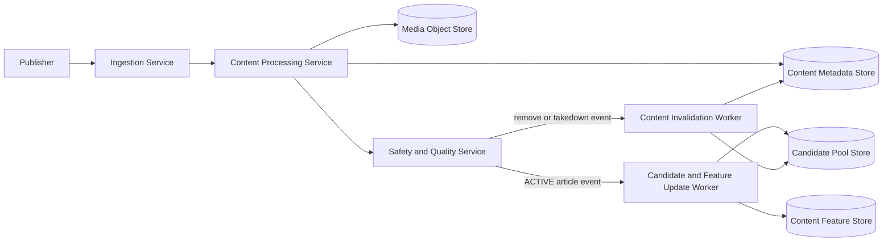
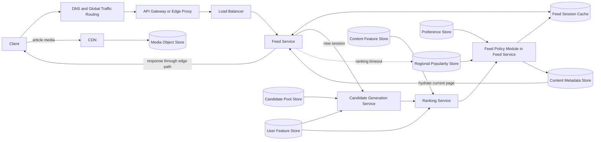
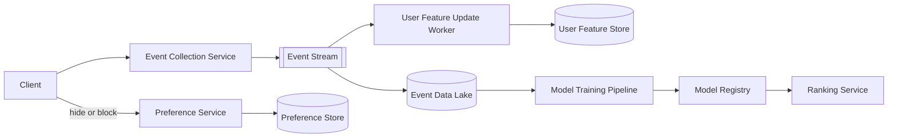
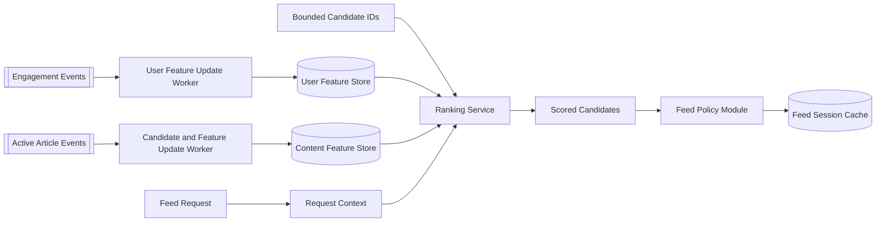

# Personalized News Feed — System Design Interview Quick Reference

This is an interview guide, not a single “correct” production architecture. The goal is to demonstrate how you resolve ambiguity, establish scope, propose a coherent design, defend tradeoffs, investigate one risky area deeply, and close the interview clearly.

The running problem is:

> Design a backend that produces a personalized news feed for millions of readers. It should incorporate machine-learning ranking, react to user feedback, admit fresh articles quickly, and remain available at low latency when personalization components fail.

## The four-step interview framework

| Step | Typical 45-minute budget | Main outcome |
|---|---:|---|
| 1. Understand the problem and establish scope | 5–8 minutes | Agreed requirements, scale, assumptions, exclusions, and success criteria |
| 2. Propose a high-level design and get buy-in | 10–12 minutes | Main components and end-to-end flows accepted by the interviewer |
| 3. Design deep dive | 18–20 minutes | One critical path examined through normal operation, scale, correctness, failure, mitigation, and tradeoffs |
| 4. Wrap up | 3–5 minutes | Recap, primary tradeoff, weaknesses, operations, and next-scale improvements |

For a 60-minute interview, expand Step 2 and Step 3 rather than spending 20–30 minutes clarifying requirements. Treat the budgets as pacing guides, not rigid countdowns.

---

## Step 1 — Understand the problem and establish scope

Do not begin by drawing databases and queues. First ask questions whose answers could change the architecture.

### Functional scope

- What content appears in the feed: publisher articles, user-generated posts, video, or a mixture?
- Is article ingestion in scope, or is an existing ingestion system an upstream dependency?
- Do readers only open articles, or can they hide, save, like, follow, and block?
- Is the feed infinite-scroll with cursor pagination?
- Must an active pagination session remain stable while new content arrives?
- How much of the ML lifecycle is in scope: candidate generation, online inference, feature processing, training, and deployment?
- Are advertising, publisher crawling, media delivery, and editorial tools in or out of scope?

### Scale and workload

Ask for values that influence design decisions:

- Daily active users and geographic distribution.
- Sessions per user per day.
- Pages per session and stories per page.
- Peak-to-average traffic multiplier.
- New articles per day.
- Impression, click, and explicit-feedback volume.

Example interview assumptions:

```text
10 million daily active users
5 feed sessions per user per day
4 page requests per session
20 stories per page
10× peak-to-average traffic
500,000 new articles per day
```

Useful estimates:

```text
Feed requests/day
= 10M × 5 × 4
= 200M requests/day

Average feed QPS
= 200M / 86,400
≈ 2,300 QPS

Peak feed QPS
≈ 23,000 QPS

Logical impressions/day
= 200M pages × 20 stories
= 4B impressions/day
```

The 20 stories multiply impression volume, not feed-request QPS. Batch page impressions into one transport message when possible.

### Quality requirements

Clarify measurable targets rather than saying “fast” or “highly available.” For example:

- Feed API: p95 below 300 ms.
- Feed serving: 99.99% availability.
- Newly approved content: eligible within two minutes.
- Explicit hide/block feedback: effective within 30 seconds.
- Passive behavior: reflected in online features within several minutes.
- ML failure: degrade recommendation quality rather than return an error or empty feed.

### Important invariants

- Unsafe, removed, expired, or blocked content must not be returned.
- One pagination session has a stable order and does not return duplicates.
- A Ranking Service failure must not make the feed unavailable.
- Explicit negative feedback must override cached recommendation quality.

### End Step 1 with an agreed requirements summary

Summarize aloud and keep a compact memo visible. Organize it so the functional requirements map directly to the high-level workflows in Step 2.

#### Functional requirements

- **Workflow A — Article publishing and ingestion:** Publishers or editors can publish articles; only active, safe, policy-compliant content becomes eligible for distribution.
- **Workflow B — Online feed serving:** Readers receive a personalized, cursor-paginated feed and can open the returned articles.
- **Workflow C — Feedback and learning:** Readers can click, read, save, like, hide, or block; these signals improve future recommendations.
- **Cross-flow correctness:** Removed, expired, unsafe, blocked, or duplicate content must not appear in the returned feed.

#### Non-functional and quality requirements

- **Relevance:** Articles should reflect the reader's interests while preserving useful topic and publisher diversity.
- **Latency:** Feed responses should complete below 300 ms at p95.
- **Availability:** Feed serving should reach 99.99% availability and return a degraded non-ML feed when personalization fails.
- **Content freshness:** Newly approved articles should become eligible within two minutes.
- **Feedback freshness:** Explicit hides or blocks should take effect within 30 seconds; passive behavior may update features within several minutes.
- **Scalability:** Assume 10M DAU, approximately 2.3K average and 23K peak feed QPS, and roughly 4B logical impressions per day.
- **Pagination correctness:** One feed session should have a stable order and should not return duplicate articles.

#### Out of scope

- Publisher crawling and partner integration details.
- Media encoding and large-file delivery internals.
- Advertisement selection and ranking.
- ML model mathematics and training-algorithm derivation.

The labels intentionally map to **Flow A**, **Flow B**, and **Flow C** in Step 2. If a functional requirement has no corresponding flow, the architecture is probably incomplete. If a major flow maps to no requirement, justify it or remove it as possible scope creep.

Ask: **“Does this scope and requirement summary look right before I propose the architecture?”**

---

## Step 2 — Propose a high-level design and get buy-in

The high-level design is a logical backend architecture, not a cloud-deployment diagram. Show clients, services, storage roles, synchronous calls, asynchronous boundaries, and the three core flows.

### Component naming convention

Use names that reveal both responsibility and runtime role:

- **`... Service`** — an independently deployed component serving synchronous requests, such as `Feed Service`, `Candidate Generation Service`, and `Ranking Service`.
- **`... Worker`** — an asynchronous event consumer or background processor, such as `User Feature Update Worker`.
- **`... Pipeline` or `... Job`** — an offline or scheduled workflow, such as `Model Training Pipeline`.
- **`... Module`** — logic that stays inside a service process, such as `Feed Policy Module` inside the `Feed Service`.
- **`... Store`, `... Cache`, or `... Registry`** — persisted or cached data, not executable services.
- Keep standard infrastructure names such as `CDN`, `Load Balancer`, `DNS`, and `Event Stream`.

Do not append `Service` to every box. Use it consistently only for actual service boundaries; otherwise the diagram hides important synchronous, asynchronous, and storage distinctions.

### Prefer one focused diagram per core flow

Do not force all components into one giant diagram. Draw one small diagram for each functional workflow, then connect the diagrams through named shared data or services:

- **Flow A produces** active content metadata, content features, and candidate pools consumed by Flow B.
- **Flow B produces** impressions and engagement events consumed by Flow C.
- **Flow C updates** user features, preferences, and model versions consumed by Flow B.

This keeps each end-to-end path explainable while still showing how the whole system forms a feedback loop. The diagrams below show one credible design, not the only valid answer.

The core personalization contract connecting the flows is:

```text
ranking_score = f(user_features, content_features, request_context)
```

Flow A produces content features, Flow C produces user features and model versions, and Flow B supplies request context, retrieves bounded candidates, calls the Ranking Service, applies hard policy and slate rules, and preserves the resulting order in a feed session.

### Flow A — Article ingestion



1. Authenticate the publisher and validate an idempotent publishing request.
2. Store article metadata in a `PENDING` or `PROCESSING` state.
3. Store large images or videos in object storage; serve them through a CDN.
4. Extract topics, language, region, freshness, quality, and embedding features.
5. Run safety, policy, quality, and duplicate-story checks.
6. Only an `ACTIVE` article may enter indexes and candidate pools.
7. Publish update, expiry, removal, and takedown events so indexes, pools, and caches can react.

### Flow B — Online feed serving



#### Quick reference — client-to-service edge path

- **DNS/global traffic routing** resolves the API hostname to a healthy regional endpoint. It helps route readers to a nearby region but is not a service that processes every feed record.
- **API gateway or edge proxy** terminates TLS and commonly handles authentication checks, rate limiting, request validation, WAF/DDoS controls, and request routing.
- **Load balancer** performs health checks and distributes requests across stateless Feed Service replicas within the selected region or availability zones.
- **CDN** is primarily a separate media path for article images, video, and other public immutable assets backed by object storage. Avoid shared caching of personalized feed responses unless privacy, cache keys, invalidation, and acceptable staleness are explicitly designed.

These boxes establish the network boundary and availability path. Mention them briefly, then spend most interview time on candidate generation, ranking, session correctness, and fallback behavior unless edge or multi-region routing is the selected deep dive.

#### Quick reference — user features versus content features

- **User features** are keyed by `user_id` and describe preferences or recent behavior: topic affinity, publisher affinity, language, country, recent clicks, and negative feedback. They change as readers interact, contain privacy-sensitive data, and need user-specific retention and deletion policies.
- **Content features** are keyed by `article_id` and describe reusable article properties: topic, language, publisher, age, quality, popularity, embedding, and estimated reading time. They are produced mainly by ingestion or content-processing pipelines and can be shared across many readers.
- Keep them as separate logical tables, namespaces, ownership boundaries, and update pipelines. They may still use the same physical feature-store platform when its scaling, isolation, availability, and governance are sufficient; separate logical domains do not automatically require separate database products.
- The Ranking Service retrieves one user's features and batch-loads content features for the bounded candidate set, then joins them with request context before inference.

For an existing cursor, read from the stable feed-session cache and apply current hard suppressions.

For a new session:

1. Retrieve candidate pools, user state, and user features in parallel.
2. Merge candidate sources and deduplicate article IDs.
3. Apply hard pre-ranking eligibility filters: safety, active status, region, language, expiry, and user blocks.
4. Batch-load content features and score the bounded candidate set with the Ranking Service.
5. Apply post-ranking slate rules: topic/publisher diversity, canonical-story deduplication, and verified editorial constraints.
6. Cache approximately 200 ordered article IDs as an immutable feed session.
7. Hydrate metadata for only the first 20 articles.
8. Return the page and an opaque cursor.

Example candidate mixture:

```text
150 recent topic-matched articles
100 articles from followed publishers
100 popular regional articles
100 collaborative-filtering candidates
 50 verified breaking-news candidates
---------------------------------------
500 candidates before merge/dedup/filtering
```

### Flow C — Feedback and learning



1. Batch impression events; send clicks, meaningful reads, saves, hides, and blocks.
2. Publish events to a partitioned stream using an `event_id` for idempotency.
3. Update recent online user features within minutes.
4. Update explicit suppression state more quickly than passive features.
5. Preserve historical events in a data lake for training and evaluation.
6. Build versioned datasets, train models, evaluate them, and register approved artifacts.
7. Deploy with canary or A/B evaluation, monitor results, and retain rollback capability.

### Get explicit buy-in

Walk through one write path and one read path, explain why each specialized component exists, and ask:

> “Does this blueprint satisfy the agreed scope? If so, I would like to deep-dive into hybrid ranking and stable feed-session pagination because they determine our latency, personalization, and correctness.”

---

## Step 3 — Deep-dive answer bank

Do not spend this step reciting every endpoint, table, or technology. Agree with the interviewer on one primary deep dive, explore it through the normal flow, bottleneck, invariant, failure, mitigation, and tradeoff, and use the other topics as prepared follow-ups.

The six topics below are a **preparation menu**, not six required interview sections. In the real interview, expect to explore one topic deeply or, if the interviewer redirects, one primary topic plus a closely related second topic.

For a 20-minute Step 3, manage time approximately like this:

1. **About 2 minutes:** agree with the interviewer on the primary topic and restate the requirements or invariants it must protect.
2. **About 14 minutes:** stay on that topic through its normal flow, bottleneck, data or API details, correctness invariant, failure mode, mitigation, and tradeoff.
3. **About 3 minutes:** answer an interviewer-selected follow-up or connect one closely related second topic.
4. **About 1 minute:** summarize the key decision and its cost.

For example, the interviewer might select feed-session pagination and then ask how it behaves when the Preference Store or Feed Session Cache fails. Another interview might focus almost entirely on scaling the Ranking Service, while another may choose event idempotency and feature freshness. Do not switch topics merely because another prepared section exists.

### Deep dive 1 — Feed API, session schema, and pagination correctness

This is the best primary deep dive because it connects the user-visible API to cache design, consistency, and correctness.

#### API contract

```http
GET /feed?cursor=<opaque-cursor>&limit=20
Authorization: Bearer <token>
```

```json
{
  "items": [
    {
      "article_id": "article-900",
      "title": "A New Language Release",
      "publisher": "Technology Daily",
      "thumbnail_url": "https://cdn.example/..."
    }
  ],
  "next_cursor": "opaque-signed-token"
}
```

The authenticated user comes from the token, not a client-supplied `user_id`. Cap `limit`, for example at 50, so one request cannot create an unbounded hydration or ranking workload.

The opaque cursor logically contains or references:

```text
session_id, next_scan_position, expires_at, signature
```

The signature prevents clients from changing the session or offset. Bind the session to the authenticated user on the server.

#### Feed-session record

```text
Key: feed_session:{user_id}:{session_id}

Value:
  ordered_article_ids: [id1, id2, ... id200]
  model_version: model-v42
  candidate_pool_version: jp-ja-108
  source: personalized | stale-personalized | regional-popular
  created_at: timestamp
  ttl: 15–30 minutes
```

Create the record atomically and treat the ordered list as immutable. For an existing cursor, do not re-rank the remaining items; scan the saved order.

If the reader hides a publisher after page one:

1. Read page two from the original ordered session.
2. Check the latest suppression and takedown state.
3. Skip invalid IDs and overfetch until 20 valid unseen articles are collected.
4. Advance the cursor past every examined ID, including skipped IDs.

This preserves stable order and avoids duplicates while enforcing a newly written hide. The tradeoff is that a new article normally waits for refresh or a new session instead of appearing halfway through pagination.

**Prepared answer:**

> “I use a server-side immutable session because an offset into a newly ranked list is unstable. The signed cursor identifies the session and next scan position. I apply current hard suppressions on every page and advance over skipped IDs, which preserves no-duplicate pagination without returning newly forbidden content.”

### Deep dive 2 — Ranking score, feature stores, and low-latency serving

The core personalization idea is:

```text
ranking_score = f(user_features, content_features, request_context)
```

For each candidate article, the Ranking Service combines information about the reader, the article, and the current request. It returns one or more predictions that are converted into a ranking score. This equation explains why the architecture needs separate user and content feature pipelines, a request-time context assembler, bounded candidate generation, online inference, and a feedback loop.

#### What each input means

| Input | Examples | Owner and location | Typical freshness |
|---|---|---|---|
| User features | Topic and publisher affinity, language, recent reading behavior, long-term embedding | User Feature Update Worker → User Feature Store, keyed by `user_id` | Seconds to minutes for recent behavior; slower for long-term features |
| Content features | Topic, publisher, language, content embedding, quality, publication time, popularity | Candidate and Feature Update Worker → Content Feature Store, keyed by `article_id` | Created at activation; popularity and trend values update nearline |
| Request context | Current time, region, device, session behavior, candidate source | Constructed in memory by the Feed Service or Ranking Service | Per request |

Explicit hides and blocks belong in the Preference Store and are enforced as hard filters. Safety, takedown, expiry, and regional eligibility come from authoritative content state. They must not become weak model features that a high relevance score can override.

#### How the equation creates the architecture



This separation matters because the data has different keys, producers, update rates, reuse patterns, and privacy rules. The Ranking Service reads one user-feature record, batch-reads content features for the bounded candidates, and creates a row such as `(user, article, context)` for each candidate. Context is usually computed for the request rather than stored as another long-lived database.

Minimal logical records:

```text
User Feature Store
  PK: user_id
  values: topic_affinities, publisher_affinities, recent_embedding,
          language, feature_version, updated_at

Content Feature Store
  PK: article_id
  values: topic, publisher_id, language, content_embedding, quality,
          published_at, popularity_features, feature_version, updated_at
```

The stores may use the same physical online feature platform, but keep separate logical tables, ownership, access control, retention, and update pipelines.

#### From model predictions to the final order

One model may directly output a scalar score. A multi-objective design can instead produce several predictions:

```text
predictions = MLModel(user_features, content_features, request_context)

ranking_score =
    alpha * P(click)
  + beta  * P(meaningful_read)
  + gamma * P(save)
  - delta * P(hide)
  + freshness_boost
```

The exact model family and weights are normally out of scope. What matters is defining the product objective and logging the model and feature versions used to produce each impression. After sorting by score, the Feed Policy Module applies slate-level rules such as topic diversity, publisher diversity, canonical-story deduplication, and verified emergency-news insertion. These rules operate on the whole result list and therefore are not fully represented by an independent per-article score.

#### Online scoring path

```text
load shared candidate pools, user features, and preferences in parallel
  → merge and deduplicate roughly 500 candidate IDs
  → apply hard eligibility filters
  → batch-load content features
  → build approximately 500 (user, article, context) feature rows
  → batch-score them in one Ranking Service request
  → apply diversity and canonical-story deduplication
  → save the top 200 IDs as one immutable session
  → hydrate only the first 20 items
```

The system does not score every article for every request. Offline and nearline workers prepare reusable pools by region, language, topic, publisher, recency, and popularity. Online work is bounded to a few hundred candidates and runs only when creating or refreshing a session, not for every pagination request.

At 23K peak feed QPS, scoring 500 articles for every request would mean 11.5M candidate scores per second. If, for example, only 25% of requests create a new session, the peak falls to roughly 2.9M candidate scores per second. This estimate motivates bounded candidate sets, batch inference, session reuse, autoscaling, and load shedding.

#### Example p95 latency budget

| Stage | Budget |
|---|---:|
| Edge, authentication, and routing | 15 ms |
| Candidate pools, user features, and preferences in parallel | 45 ms |
| Eligibility filtering and content-feature batch read | 25 ms |
| Batch ranking | 70 ms |
| Diversity and deduplication | 15 ms |
| Session write and first-page hydration in parallel | 45 ms |
| Serialization and response | 20 ms |
| **Planned total** | **235 ms** |
| **Tail-latency headroom** | **65 ms** |

Use request deadlines shorter than the overall API deadline. Batch feature and metadata reads, parallelize independent work, avoid per-candidate RPCs, and hydrate only the returned page.

#### Freshness, correctness, and failure behavior

- The User Feature Update Worker consumes recent events and updates soft interests asynchronously; delayed events reduce relevance but should not break serving.
- The Candidate and Feature Update Worker writes content features before or together with making an article eligible for candidate pools.
- Log `model_version`, `feature_version`, candidate source, impression position, and outcome so training can reproduce and evaluate serving decisions.
- Reuse feature definitions between training and serving, or version transformations explicitly, to control training-serving skew.
- If user features are missing, use new-user, regional, or segment defaults. If a candidate lacks required content features, skip it or use a documented safe default.
- If a feature batch or model request times out, use a recent complete personalized snapshot or the popularity fallback; do not return a half-ranked mixture with unpredictable ordering.

**Prepared answer:**

> “The center of the design is `score = f(user features, content features, context)`. User features are updated from behavior and keyed by user ID; content features are produced during ingestion and keyed by article ID; request context is assembled online. For a new session, I read one user vector and batch-read features for about 500 candidate IDs, then score them in one inference call. Hard safety and suppression filters stay outside the model, and slate rules run after scoring. Bounded candidates and session reuse trade some recall and freshness for predictable latency, availability, and inference cost.”

### Deep dive 3 — Scaling to millions of readers

The scale assumptions imply approximately 23K peak feed QPS and 4B logical impressions per day. No single database choice solves this; the design must bound work, partition state, and move high-volume writes off the serving path.

| Component | Scaling decision | Partition or cache key |
|---|---|---|
| Feed Service | Stateless replicas behind a load balancer; autoscale by QPS and latency | No local authoritative state |
| Feed Session Cache | Shard short-lived sessions across cache nodes | Hash of `user_id + session_id` |
| User Feature Store | Distribute independent per-user reads and updates | `user_id` |
| Content Feature Store | Batch-read reusable features across candidates | `article_id` |
| Candidate Pool Store | Precompute versioned shared pools; replicate hot pools | `region + language + segment + version` |
| Content Metadata Store | Batch-get only the current page | `article_id` |
| Event Stream | Batch impressions and partition for per-user ordering | `user_id`; deduplicate by `event_id` |

Important scale techniques:

- Do not fan out and materialize a full feed for every user whenever an article is published.
- Precompute shared candidate pools, then perform bounded online personalization.
- Batch 20 impression records into one client request and stream message when practical.
- Replicate or locally cache hot regional pools; avoid one mutable global popularity key.
- Protect cold-cache recovery with request coalescing, admission control, TTL jitter, and stale-while-revalidate behavior.
- Monitor partition skew, cache hit rate, batch size, inference utilization, and stream backlog rather than only total QPS.

**Prepared answer:**

> “I scale the read path horizontally because the Feed Service is stateless. User-owned state partitions naturally by user ID, content by article ID, and shared pools by region and segment. The key optimization is architectural: reuse precomputed pools and rank only hundreds of candidates, while batching billions of feedback records through an asynchronous stream.”

### Deep dive 4 — High availability, fallback, and multi-region behavior

Run stateless serving components across multiple availability zones. Give each synchronous dependency a timeout, bounded retry policy, circuit breaker, and degraded path. Keep feed serving independent from the feedback and training pipelines.

| Failure | Serving behavior | Tradeoff |
|---|---|---|
| Ranking Service timeout | Use a recent complete personalized snapshot, otherwise a regional/segment popular pool | Lower relevance |
| User Feature Store or Content Feature Store timeout | Use a recent complete snapshot or popularity fallback; do not assemble partially scored results | Staler personalization |
| Feed Session Cache loss | Return a filtered popular feed and create a replacement session after recovery | Session order may restart |
| Partial metadata batch read | Skip missing items and overfetch replacements | Smaller page if too many records fail |
| Event Stream backlog | Continue serving; delay passive-feature learning and alert on freshness lag | Recommendations learn more slowly |
| Regional outage | Route to another healthy region with replicated content and pools | Higher latency and possibly stale user state |

Fallback hierarchy:

```text
existing healthy session
  → freshly ranked personalized session
  → recent complete personalized snapshot
  → precomputed regional or segment popular pool
  → small verified editorial or emergency pool
```

Fallback may reduce relevance, but it must still enforce safety, takedown, expiry, region/language eligibility, and explicit user suppressions. If the authoritative safety state is unavailable, prefer a small previously verified pool instead of serving unknown content.

For Japan and US traffic, keep content metadata, active candidate pools, models, and media available in both serving regions. Assign users a home region for feature and preference writes. A failover region may temporarily use replicated or stale soft-preference data, but hard takedown and suppression paths need faster replication or conservative filtering.

**Prepared answer:**

> “Availability comes from failure isolation and graceful degradation, not only replicas. Ranking and learning are optional for serving; policy checks are not. I deploy across zones, use strict dependency deadlines, and fall back through complete known-good feeds while preserving safety and explicit blocks.”

### Deep dive 5 — Feedback ingestion and continuous learning

Passive engagement is high-volume and asynchronous, but an explicit hide or block is user-visible correctness and should have a faster durable write path.

#### Batched engagement API

```http
POST /feed/events
Authorization: Bearer <token>
Idempotency-Key: <request-id>
```

```json
{
  "events": [
    {
      "event_id": "event-123",
      "article_id": "article-900",
      "session_id": "session-88",
      "event_type": "impression",
      "position": 3,
      "event_time": "2026-09-01T10:05:00Z",
      "model_version": "model-v42"
    }
  ]
}
```

The Event Collection Service derives `user_id` from authentication, validates and enriches the event, and appends it to the Event Stream. Partition by `user_id` when per-user order matters. Assume at-least-once delivery and make consumers idempotent using `event_id`; do not claim end-to-end exactly-once processing without defining the boundary.

#### Explicit suppression API

```http
PUT /feed/preferences/suppressions/publisher-77
Authorization: Bearer <token>
```

Do not send a hide only through the asynchronous feedback pipeline. A stream trades immediate completion for buffering, so consumer lag could let hidden content reappear. Split the operation into two paths:

```text
Correctness path:
Client -> Preference Service -> durable Preference Store -> acknowledge

Learning path:
committed preference change -> Event Stream -> features, analytics, training
```

A DynamoDB preference table can group one user's independently addressable suppressions:

```text
PK: user_id
SK: suppression_type#target_id

user-42 | PUBLISHER#publisher-77
user-42 | TOPIC#cryptocurrency
user-42 | ARTICLE#article-900
```

The Preference Service writes a deterministic key before acknowledging the request. Retrying the same `PUT` is therefore idempotent. After DynamoDB returns HTTP 200, the write is durably persisted. Feed page reads query the latest suppression state even for an older immutable feed session, skip invalid IDs, and overfetch replacements. Use a strongly consistent base-table read after a recent hide when read-your-writes is required; do not use a global secondary index as the authoritative immediate-read path because DynamoDB GSIs are eventually consistent. See [AWS DynamoDB read consistency](https://docs.aws.amazon.com/amazondynamodb/latest/developerguide/HowItWorks.ReadConsistency.html) and [sort-key design](https://docs.aws.amazon.com/amazondynamodb/latest/developerguide/bp-sort-keys.html).

For example:

```text
10:00:00  hide publisher-77 is durably stored and acknowledged
10:00:01  page two reads current suppressions and skips publisher-77
10:00:20  an asynchronous worker updates the user's ML features
```

The committed DynamoDB change can be captured with DynamoDB Streams for downstream learning. Streams operate asynchronously and preserve modification order for each item, so the serving path must not wait for the consumer. Downstream processing should still be idempotent because a Lambda consumer can retry a failed batch. See [AWS DynamoDB Streams](https://docs.aws.amazon.com/amazondynamodb/latest/developerguide/Streams.html).

Failure and tradeoff summary:

- If the durable write fails, do not report that the hide succeeded.
- If the write succeeds but the response is lost, retry the same deterministic key.
- If the stream is backlogged, learning becomes stale but suppression remains correct.
- If preferences are cached, update or invalidate the cache after the write; after a recent hide, bypass an untrusted cached value or perform a strong read.
- Strong reads and synchronous writes cost more than eventual asynchronous processing, so reserve them for explicit user promises rather than passive clicks and impressions.
- If the Preference Store is unavailable, use a trustworthy recent suppression snapshot. If no authoritative snapshot exists and suppressions are a hard invariant, fail closed or use a conservative safe fallback rather than silently serving possibly blocked content.

Stream consumers update recent User Feature Store values within minutes. Historical events flow to the Event Data Lake, where the Model Training Pipeline constructs versioned datasets, evaluates a new model, registers it, and rolls it out through canary or A/B testing. Record `model_version`, position, and candidate context so offline evaluation can distinguish model behavior from presentation bias.

**Prepared answer:**

> “I separate passive learning events from explicit preference correctness. Impressions and clicks are batched and processed at least once with idempotent consumers. A hide is synchronously persisted through the Preference Service, then also emitted as an event, so a delayed learning pipeline cannot cause the hidden publisher to reappear.”

### Deep dive 6 — Storage technologies and why

Choose from access patterns and consistency promises, not from “SQL versus NoSQL” as a slogan. One physical product may host several separate logical tables, but the User Feature Store and Content Feature Store remain distinct domains.

#### Quick reference — SQL versus NoSQL and DynamoDB scaling

The number of users is not, by itself, a reason to choose NoSQL. Start with the reads, writes, and invariants:

| Prefer relational SQL when | Prefer a key-value/document store when |
|---|---|
| The main workflow needs joins, flexible queries, constraints, or multi-row transactions | The main workflow performs point or batch lookups using a known key |
| Related records frequently change together | Most records can be read and updated independently |
| Query flexibility is more important than a simple partition path | Predictable horizontal partitioning and high request throughput are dominant |

For this news feed, the editorial source of truth may remain relational if editors need rich publisher/article workflows. The online serving path is different: ranking has already produced article IDs, so the Feed Service needs fast lookups such as `article-7 -> title, publisher, thumbnail, status`. A DynamoDB serving projection fits that access pattern:

```text
ContentMetadata table
  PK: article_id
  values: publisher_id, title, thumbnail_key, status,
          language, region, expires_at, version
```

For one page, send one `BatchGetItem` containing the 20 ranked article IDs instead of issuing 20 sequential calls. DynamoDB supports up to 100 items in one batch, although a partial result can return `UnprocessedKeys`, which should be retried with bounded backoff. Batching reduces network round trips; it does not reduce the database capacity consumed by the item reads. See the [AWS `BatchGetItem` documentation](https://docs.aws.amazon.com/amazondynamodb/latest/APIReference/API_BatchGetItem.html).

Using the interview assumptions:

```text
23,000 peak page requests/second * 20 articles/page
= 460,000 logical metadata item reads/second before caching
```

This calculation motivates horizontal distribution. DynamoDB hashes the high-cardinality `article_id` partition key and places different items on different storage partitions. It manages partitions automatically as storage and throughput grow. See [AWS DynamoDB partitions and data distribution](https://docs.aws.amazon.com/amazondynamodb/latest/developerguide/HowItWorks.Partitions.html).

Keep sharding and replication distinct:

```text
Sharding / partitioning                    Replication
different data on different partitions    copies of the same data

article-7 -> partition A                   article-7 -> copies across AZs
article-9 -> partition B

scales storage and request throughput      improves availability and durability
```

Both use more machines horizontally, but they solve different requirements. Sharding lets many partitions process different article IDs in parallel. Replication keeps the same data available when a server or Availability Zone fails. DynamoDB handles both inside a Region: it partitions the table and automatically replicates data across three Availability Zones, providing built-in high availability and durability. Multi-AZ replication is not cross-Region disaster recovery; use DynamoDB global tables only when the design requires cross-Region replicas. See [AWS DynamoDB resilience and disaster recovery](https://docs.aws.amazon.com/amazondynamodb/latest/developerguide/disaster-recovery-resiliency.html).

Important limits and tradeoffs:

- A breaking-news article is one `article_id`, so hashing cannot spread that single hot key across many partitions. Protect hot metadata with a regional cache and request coalescing; do not claim that sharding alone solves it.
- DynamoDB can still throttle a hot partition or a traffic jump beyond available table capacity. Monitor throttling and partition skew, request quota increases or pre-warm when necessary, and retry only bounded transient failures. See [AWS DynamoDB partition-key guidance](https://docs.aws.amazon.com/amazondynamodb/latest/developerguide/bp-partition-key-design.html) and [on-demand scaling behavior](https://docs.aws.amazon.com/amazondynamodb/latest/developerguide/on-demand-capacity-mode.html).
- Eventual reads may be acceptable for an article title but not necessarily for takedown status. Choose consistency per operation and keep the safety/suppression path authoritative. DynamoDB tables support optional strongly consistent reads, while global secondary indexes are eventually consistent. See [AWS DynamoDB read consistency](https://docs.aws.amazon.com/amazondynamodb/latest/developerguide/HowItWorks.ReadConsistency.html).
- Maintaining both a relational source and a DynamoDB serving projection duplicates data and adds synchronization work. Use both only when the editorial and serving access patterns justify that cost.

**Interview-ready answer:**

> “I choose from access patterns, not merely from the number of users. Editorial workflows may use SQL for relationships and transactions, but the feed-serving path already knows the article IDs, so I publish an article-ID-keyed projection to DynamoDB and batch-read one page. DynamoDB shards different article IDs across partitions to scale storage and throughput, while it replicates the same data across three Availability Zones for availability and durability. A single popular article can still be a hot key, so I add caching and monitor throttling rather than claiming partitioning solves every load pattern.”

| Data | Required behavior | Reasonable options | One defensible choice |
|---|---|---|---|
| Feed sessions | Very low latency, ordered IDs, TTL, disposable data | Redis-like distributed cache; key-value store with TTL | Redis-like cache because sessions are short-lived and rebuildable |
| Content metadata | Batch lookup by `article_id`, high read volume, simple state transitions | DynamoDB-like key-value/document store; Cassandra-like wide-column store; sharded SQL | Managed key-value/document store for the serving copy; use conditional state updates for activation |
| User preferences | Durable writes by `user_id`, read-your-writes for hides, small records | Key-value/document store; relational database | Durable key-value/document store plus cache; request a consistent read after a recent hide when necessary |
| User features | Low-latency lookup by `user_id`, frequent incremental updates | Online feature store backed by key-value/wide-column storage | Separate user-feature table in the online feature platform |
| Content features | Batch lookup by `article_id`, shared across users, versioned features | Online feature store backed by key-value/wide-column storage | Separate content-feature table in the same platform if isolation is sufficient |
| Candidate pools | Versioned list lookup by region/language/segment; hot reads | Durable key-value store with cache; wide-column store | Durable versioned pool plus Redis-like regional cache |
| Feedback events | Append, partition, replay, absorb bursts | Kafka-like log; managed streaming service | Partitioned durable event stream keyed by `user_id` |
| Historical events and media | Cheap durable object retention | Object storage | Separate object-storage buckets and lifecycle policies |

Example logical keys:

```text
Content Metadata Store:  PK = article_id
User Feature Store:      PK = user_id, feature/model version in the value
Content Feature Store:   PK = article_id, feature/model version in the value
Preference Store:        PK = user_id, SK = suppression_type#target_id
Candidate Pool Store:    PK = region#language#segment, SK = pool_version
Feed Session Cache:      key = user_id#session_id
Event Stream:            partition key = user_id, idempotency key = event_id
```

SQL remains valid when publisher workflows require rich relationships, flexible editorial queries, or multi-record transactions. A common answer is to keep a relational editorial source of truth and publish an article-ID-keyed serving view. Only introduce both if the additional operational complexity solves a stated requirement.

**Prepared answer:**

> “I would use a small polyglot set: a Redis-like cache for rebuildable sessions, a durable key-value/document store for serving metadata and preferences, separate logical online feature tables, a partitioned event stream, and object storage for media and training history. Each choice follows its access pattern; I would not create a different database product for every box.”

### API and schema depth rule

- **Step 1:** name user-visible operations; do not draw schemas.
- **Step 2:** name the main API boundary and key entities only if they clarify a flow.
- **Step 3:** show the request/response, key fields, primary or partition key, consistency promise, and failure behavior for the selected deep dive.
- **Step 4:** identify omitted schemas, migrations, or technology refinements as future work.

The API and schema are supporting evidence for a design decision. They are not separate checklist sections that must consume interview time.

---

## Step 4 — Wrap up

Do not end immediately after the deep dive. Give a concise recap and show that you understand the design’s limits.

### Example recap

> “I designed three connected flows. Content ingestion validates and activates safe articles before updating candidate pools. Feed serving uses reusable regional/segment candidate pools plus bounded online ranking, then caches an immutable list of article IDs for stable pagination. Feedback updates online preferences quickly and also feeds an offline training and model-deployment pipeline. The primary tradeoff is that session stability and precomputation reduce freshness and personalization slightly, but they provide predictable latency and availability.”

### Finish with operational considerations

- Bottlenecks: batch inference capacity, hot candidate pools, cache stampedes, and metadata batch reads.
- Failures: Ranking Service timeout, Feature Store timeout, Feed Session Cache loss, Event Stream backlog, and regional outage.
- Observability: feed latency, fallback rate, empty-feed rate, cache-hit rate, ingestion lag, feature freshness, stream lag, model errors, and recommendation-quality metrics.
- Security and privacy: publisher authorization, event minimization, retention, deletion, encryption, and access controls.
- Model evolution: offline evaluation, canary/A/B rollout, model/feature versioning, drift monitoring, and rollback.
- Cost: inference volume, cross-region traffic, feature storage, event retention, and media egress.
- Next scale curve: shard by user/region, replicate read-heavy pools, isolate ML failures, and degrade gracefully.

Always name at least one limitation. Never claim the design is perfect.

---

## Interview-day checklist

- [ ] Clarify domain-specific behavior before naming components.
- [ ] Record assumptions and summarize the scope.
- [ ] Estimate only enough capacity to reveal a design pressure.
- [ ] Draw the main synchronous and asynchronous boundaries.
- [ ] Trace article ingestion, feed serving, and feedback learning end to end.
- [ ] Explain why each specialized component exists.
- [ ] Ask for high-level-design buy-in.
- [ ] Deep-dive into one risky path instead of every component.
- [ ] State a normal path, bottleneck, invariant, failure, mitigation, and tradeoff.
- [ ] Include only APIs and schemas that clarify the selected decisions.
- [ ] Recap the design and identify weaknesses before time expires.

## Common mistakes

- Spending most of the interview on clarification.
- Drawing generic DNS/load-balancer/database boxes while omitting candidate generation and ranking.
- Updating an entire per-user feed after every impression event.
- Hydrating all 200 cached articles instead of only the current page.
- Treating ML or the feature store as a mandatory dependency with no fallback.
- Filtering unsafe or blocked content only during ingestion and ignoring later takedowns.
- Mutating an active session list and breaking cursor offsets.
- Choosing a database by category name rather than access patterns and invariants.
- Listing many technologies without explaining ownership or tradeoffs.
- Ending after the deep dive without a recap.

## Final mental model

```text
Step 1: Agree on the problem.
Step 2: Agree on the blueprint.
Step 3: Prove the riskiest part.
Step 4: Show that you understand the whole system and its limitations.

Personalization core:
  article ingestion → content features
  user behavior     → user features
  current request   → context
  all three         → Ranking Service → Feed Policy Module → feed session
```
